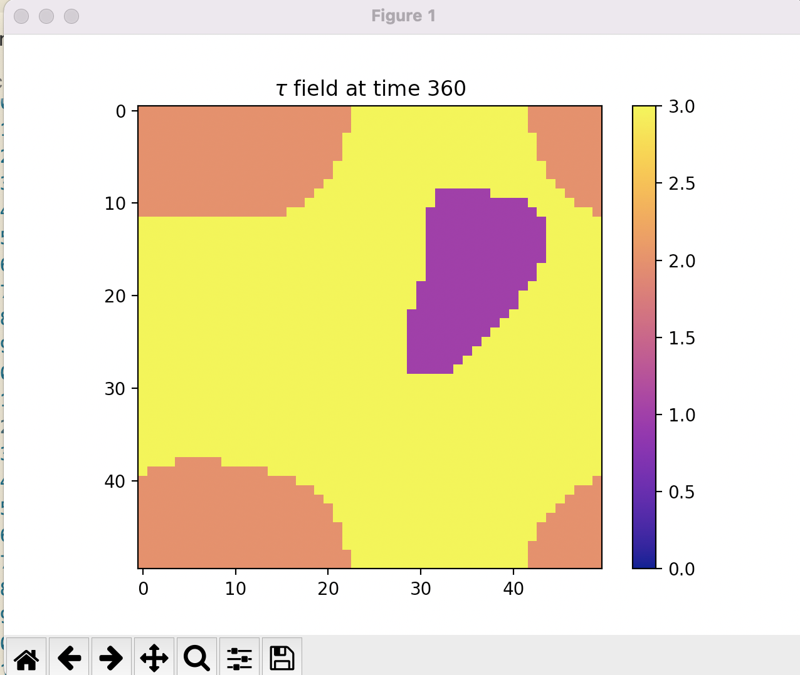
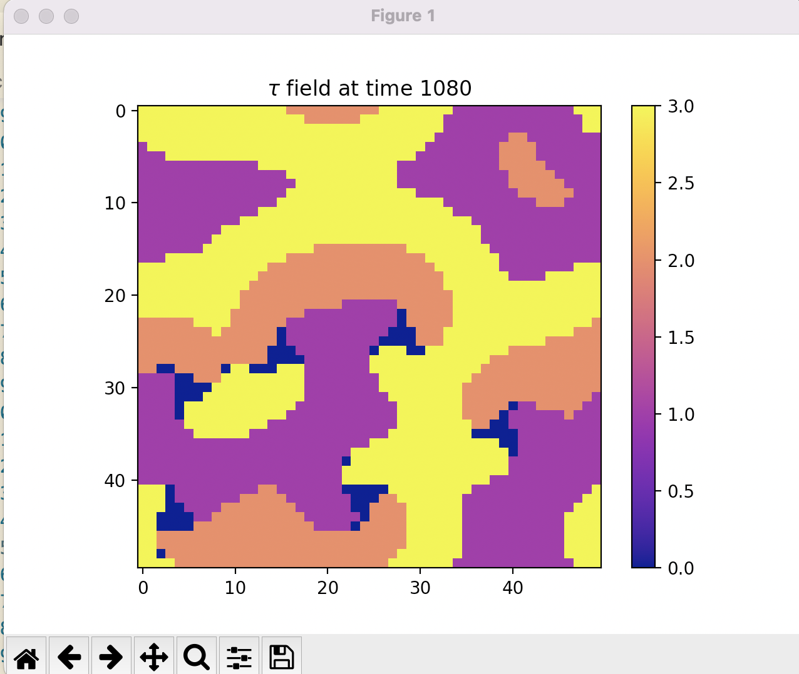

# Modelling and Visualisation in Physics Exam (2021 - 2022)

## Getting Started

Before answering the questions from the exam, this section will help you get a copy of the project and understand how to run it on your local machine for marking.

First of all, you should check your current version of Python. I used Python 3.9.0 during the exam. You can check the version you are currently using running this command in the terminal.

```
python --version
```
Running the project with the same version I used is the best approach. This will avoid dependency or configuration problems. For doing so, I provided both an *environment.yml* and a *requirements.txt* file for their use with virtual environments. 

If you use **conda** or **miniconda** you can create a new virtual environment with the same dependencies I used by calling:
```
conda env create -f environment.yml
```
This will create an environment named **MVP_Exam_2022** which you can use for running the code without having to install the dependencies on your system. You can activate it by running:

```
conda activate MVP_Exam_2022
```

On the other hand, if you use **pipenv** and **virtualenv**, you can install the packages with the specific versions I used by running:

  * `pip inst` # if you don't have virtualenv installed
  * `virtualenv MVP_Exam_2022` # to create a new environment
  * `source MVP_Exam_2022/bin/activate` # to enter the env
  * `pip install -r requirements.txt` # to install the requirements

You can read <a href="https://realpython.com/python-virtual-environments-a-primer/">this article</a> to understand the reasons for why virtual environments are important in Python.

## Files

  * [Exam Document](./README.md) --> This pdf file contains the exam description followed to complete the project.
  * [src](src) --> This directory contains the whole project.
  * [test](test) --> Directory containing several Jupyter Notebook files (.ipynb extension) to show the plots of the observables that have been asked in the exam.
  * [results](results) --> Directory with the data files used for plotting in [test](test)</a>. 

## **EXAM QUESTIONS**

Once you have the correct version of Python with all the packages installed you can now run the files to check the validity of the code.

### **Question a**
The code for the animation can be found in the method `visualise` from the class `ExamSolver` in [main.py](src/main.py). As can be seen in the end of `main.py`, I create an object of the class `ExamSolver` and I give it some parameters through a dictionary. I have two dictionaries named `params_until_question_c` and `params_from_question_d` which I used to be faster when trying the code, and avoid having to change it manually and making mistakes.

To display $\tau$ with the parameters from question b) you have to create an object of `ExamSolver` with the required parameters and call `visualise()`. The code run in main would be: 
```
params_until_question_c = {'l': 50, 'D': 1 , 'q': 1, 'p': 0.5}
solver = ExamSolve (**params_until_question_c)
solver.visualise()
```
These code is written and commented in `main.py` so that you only need to uncomment it to see the visualisation.

Screenshot of what I see for the visualisation:



The particles start being pretty homogeneous but it does not take long for two of them to dominate until all the cells take the same concentration type and we reach an absorbing state.

### **Question b**
The snapshot has been shown already and described in the previous subsection. This question was answered with the methods `get_time_to_absorption`, `get_average_absorption_time` and `is_absorbing_state`. 

The plots can be checked in [plots_question_b.ipynb](test/plots_question_b.ipynb).

I stopped to record the average fraction when I reached an asorbing state. In the concrete example I plot, it can be seen how all the particles are from type b in the end.

### **Question c**
The average time and the error (I used standard error on the mean) are obtained through get_average_absorption_time. You need to run:
* params_until_question_c = {'l': 50, 'D': 1 , 'q': 1, 'p': 0.5}
* solver = ExamSolver(**params_until_question_c)
* solver.get_average_absorption_time()

and this will print the mean and the std error on the mean. I have saved the data of the simulations in results/simulations_and_absorption_times which shows the absorption time for each of the simulations I ran.

For the data file that I submit I obtain a mean absorption time of 1441.5 and a standard error on the mean of 187.23

### **Question d**

For question d call:
```
params_from_question_d = {'l': 50, 'D': 0.5 , 'q': 1, 'p': 2.5}
solver = ExamSolver(**params_from_question_d)
solver.visualise()
```



Here we can see that we do not reach an absorbing state and the concentrations seem to be have a periodicity. This is the example that Davide showed in the last lecture (or second to last lecture?). Very nice to see it here in the exam. It is different from the first one because we don't have an absorbing state.

### **Question e**

The results for this question can be found in [test/plots_question_e.ipynb](test/plots_question_e.ipynb). We can see they have a sinusoidal shape. By taking the first peak at around 250 and the last one at around 4800 we can calculate the period as (4800 - 250) / 14 because there are 14 peaks. This gives 325.

If we check the blue plot we can do a similar thing, but starting at around 400 so we would have (4750 - 400) / 14 = 310 which is very similar. Indeed we can see that we have the same period except for some fluctuations in the beginning!

The data can be found in [results/two_points_data_question_e.csv](results/two_points_data_question_e.csv)

### **Question f**

For this question I was a bit confused at first. I explain here my reasoning.

I compared (in every row of the lattice) each element with the subsequent 25 elemenst (and including periodic boundary conditions. That is, when I got to elements with index higher than 25 I still did 25 comparisons.) To give an example, I compared particle at column 27 with the next 25 particles (remember periodic bc) to obtain how many pairs of particles had the same type of cell when the distance was one.

I repeated this procedure for the cases when the distance between cells was not 1, but 2, 3, 4, ..., 25. Then, I moved on and did this for all the rows in the lattice.

In order to obtain the probability I divided this count by 2500 since for each distance there are 2500 comparisons that I make so in the case that all the cells have the same type I would have a count of 2500. 

Furthermore, since the quetsion does not say anything about the time, I generalised this by calculating the probabilities at every time in a simulation of 1000 epochs/sweeps/timesteps. I then took the average.

The data can be found in results/questionf_D.csv. I have three data files which are different depending on the value of D. The plots are shown in `test/plots_question_f.ipynb`

We can see that as we increase D the probabily takes a bit more to decrease. They are very similar in that they reach a value of 0.4 in the end and they have the same shape. The functions used can be checked in main.py with questionf() being the main function used to get the data

I didn't have time to plot the fitting for the correlations. It seems to me that it's similar to a power law and we can therefore see a **negative correlation** in the probabilities. I would have taken the covariance between the points, but I guess that has to be next time.

## Built With

* [Python3](https://www.python.org/downloads/)
* [Conda](https://docs.conda.io/en/latest/) - Dependency Management

## Python Dependencies

* [Numpy](https://numpy.org/doc/stable/index.html)
* [Matplotlib](https://matplotlib.org/stable/)
* [Pandas](https://pandas.pydata.org/)

## Authors

* **B139699** 

